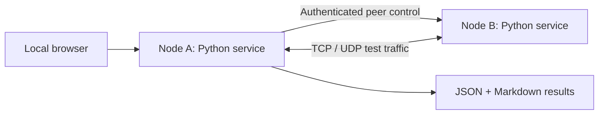

# NetLab Assist

**Network lab automation, built with AI-assisted development.**

[](https://github.com/lzwhirstle/netlab-assist/actions/workflows/build.yml)
[](https://github.com/lzwhirstle/netlab-assist/releases/latest)


Run the application on two computers, then control both from one browser. Generate test traffic, inspect protocol behavior and export results for review.

[**Download v0.2.0**](https://github.com/lzwhirstle/netlab-assist/releases/tag/v0.2.0) · [Experiment guide](docs/EXPERIMENT_GUIDE.md) · [Validation approach](docs/VALIDATION.md) · [中文使用说明](#轻量化网络实验助手)

## Project at a glance

| Problem | Implementation | Reviewable evidence |
| :--- | :--- | :--- |
| Coordinating two lab computers is repetitive | One-sided peer control and readiness checks | Peer orchestration in `server.py`; API tests |
| Proxy settings and multiple NICs complicate tests | Direct peer HTTP and route-aware multicast binding | Protocol implementation in `protocols.py` |
| Measurements need context | Explicit failure states, baselines and JSON/Markdown exports | Validation guide and browser result history |
| A useful tool needs accessible distribution | Standard-library Python runtime; standalone desktop builds | GitHub Actions and Windows/macOS release assets |

**AI development approach:** AI-assisted implementation and iteration, guided by network requirements and checked through automated tests. The shipped application performs network measurements; it has no embedded LLM or ML inference dependency.



## 轻量化网络实验助手

NetLab Assist 面向交换测试新人和实验室日常验证。两台电脑各运行一次程序，只在其中一台完成“连接实验对端”并点击测试，另一台保持程序运行即可。工具可完成吞吐、ACL、DNS/NAT、组播和连续可达性测试。源码运行时只依赖 Python 标准库，不需要安装 iPerf、数据库或 Controller。

它的定位是“快速构造流量 + 留下可复核记录”，不是伪装成 Chariot、Wireshark 或专业仪表。正式实验中，仍需把工具结果与拓扑、设备配置、端口计数器和必要的 pcap 放在一起判断。

## 直接使用

要求：Python 3.10 或更高版本。

### macOS

双击 `scripts/run-macos.command`，或在项目目录执行：

```bash
python3 run.py
```

### Windows

双击 `scripts/run-windows.bat`。如果 Windows 防火墙弹窗，只允许当前实验室的“专用网络”。

启动后浏览器自动打开 `http://127.0.0.1:18080`。右上角会显示本机地址和本轮随机生成的六位实验码。两端都启动后，在操作端输入被测端的实验网卡 IP 与实验码，点击一次“连接并检查”。检查通过后，后续双端测试都只在操作端点击；被测端不需要进入相同页面，也不需要同步点击。

连接检查会分别验证：

- `18080/tcp` 控制服务是否可达、实验码是否正确；
- `18881/tcp` 吞吐接收服务是否可用；
- `18882/tcp` 回显与连接元组服务是否可用。

如果 Windows 曾显示 `Failed to fetch`，先确认程序窗口没有退出，再从程序自动打开的 `127.0.0.1` 页面操作。若对端检查超时，优先确认选择的是实验有线网卡 IP，并在 Windows 防火墙弹窗中只允许当前实验室的“专用网络”。

默认端口：

- `18080/tcp`：本机界面和经过实验码验证的反向测试控制
- `18881/tcp`：经过实验码验证的吞吐接收端
- `18882/tcp`：经过实验码验证的 NAT 连接元组观察端

## 当前功能

- TCP 正向、反向和双向同时吞吐，支持 1/4/8/16 条并发连接
- ACL 前后验证矩阵，明确区分“连通”“拒绝”“超时”和“环境错误”
- UDP/TCP DNS A、AAAA 查询，记录 Transaction ID、源端口、报文长度和回答
- 两个 NetLab Assist 节点之间的 NAT 前后连接元组观察
- IPv4 组播单端发起、远端自动入组，统计码率、序列号、丢包、乱序和时延抖动
- TCP 连续监控，记录切换期间的中断、恢复、可用率和状态变化
- 浏览器本机保存最近 100 条结果，可导出 Markdown 报告或原始 JSON

## 最短实验流程

1. 两台电脑接入同一 VLAN，记录 IP、掩码、网关、协商速率和端口 Profile。
2. 使用相同方向、并发数和时长跑一轮基线。
3. 接入目标拓扑或下发策略，只改变一个变量。
4. 重复相同参数至少三次，分别看正向和反向结果。
5. 导出 NetLab Assist 结果，并保存设备侧计数器、配置、截图和必要的抓包。

更具体的实验对应关系见 [实验使用手册](docs/EXPERIMENT_GUIDE.md)，结果解释边界见 [验证规范](docs/VALIDATION.md)。

## 安全设计

- 页面、任务控制和历史结果只允许从运行程序的本机浏览器访问。
- 对端控制、吞吐接收和 NAT 元组接口均要求本轮实验码。
- 反向吞吐只能向发起请求的电脑回传，不能被指定为第三方反射目标。
- 测试时长、并发连接和组播速率均有限制，空闲连接会自动释放。
- 工具不自动上传结果，不包含公司报告、设备序列号、截图或固定实验地址。
- 请只在获准的封闭实验网络使用，不要把端口映射到公网。

## 判定边界

- 多流 TCP 能构造多条会话，但不能单独证明 LACP 已均匀分担；需要看成员口计数器。
- 应用收到组播只证明该接收端收到流量，不能证明未加入端口没有泛洪；需要看 IGMP 表、端口计数器或抓包。
- TCP `refused` 表示目标可达但端口未监听，不能当作 ACL 放行成功或阻断成功。
- 题目明确要求 Chariot、Wireshark 或专用仪表时，本工具只能作为补充，能否替代以导师或测试规范为准。

## 开发与验证

```bash
python3 -m unittest discover -s tests -v
python3 run.py --no-browser
```

GitHub Actions 会在每次推送后运行自动化测试，并生成 Windows、macOS Apple Silicon 和 macOS Intel 单文件程序。自动产物没有商业代码签名，首次启动可能需要在系统安全设置中确认。

## 当前状态

版本 `0.2.0`，实验工具预览版。开始正式性能测试前，应先与一个获准的参考工具做交叉验证。
